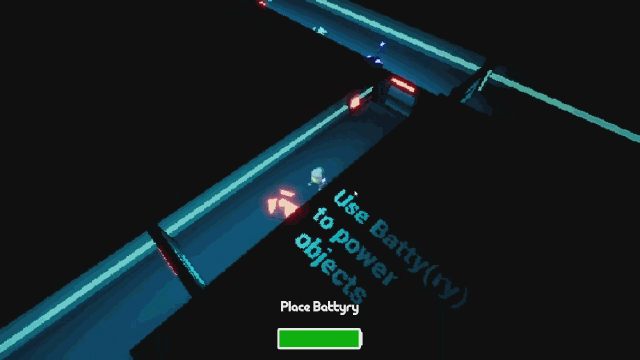
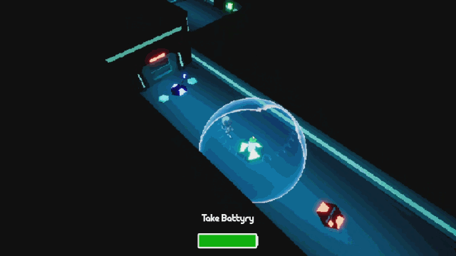

# ELECTROHOLIC

An UE4 game made during GMTKjam 2021.

[**itch.io page**](https://tricky-fat-cat.itch.io/electroholic)

## About

A little robot tries to get away from a strange facility with its beloved Batty(ry), without which it can't leave for a long time. However, the robot has to use Batty(ry) to power different objects in the facility.

## Controls

| Action   |    Keys    |
| :------- | :--------: |
| Move     | W, A, S, D |
| Interact |     E      |

## Team

1. [**Tricky Fat Cat**](https://twitter.com/tricky_fat_cat) — code, game design;
2. [**Sava T**](https://twitter.com/SavaMakesMusic) — music and sounds;
3. [**Grigorij "Syntheslav" Markov**](https://twitter.com/KrikIDDQD) — music;
4. [**Ruslan Seferbekov**](https://twitter.com/Just_Ruslan4ik) — game design, level design;
6. **Dmitriy Brusyanin** — game design, level design;
7. **Alevtina Smirnova** — game design, 2D art;
8. **Daniil Morozov** — some 3D art;

## Special thanks

[**KenneyNL**](https://twitter.com/KenneyNL) for an amazing collection of free assets.